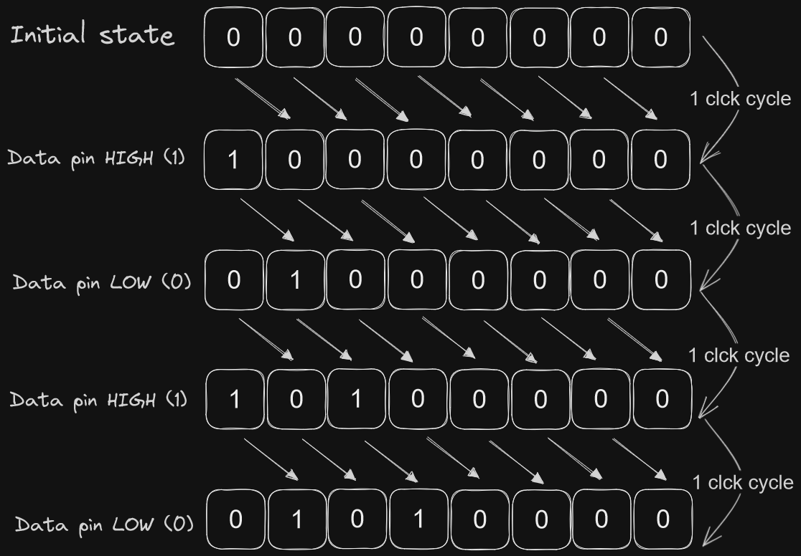
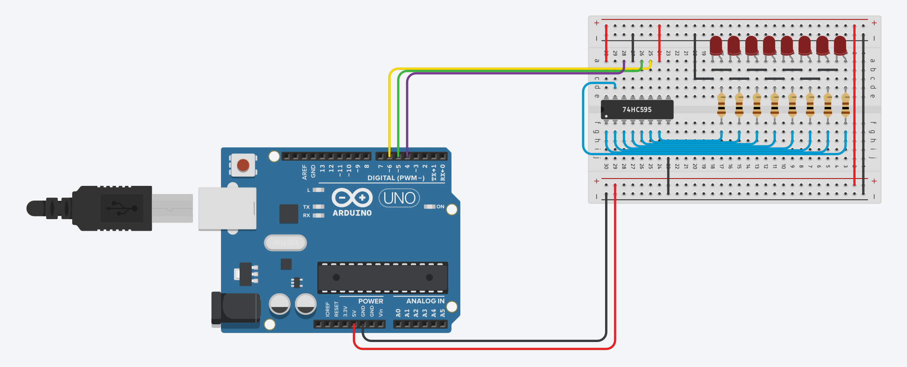

# 8 BIT Shift register (74HC595)

## 1. But what are shift registers?
"The Shift Register is another type of sequential logic circuit that can be used for the storage or the transfer of binary data" (https://www.electronics-tutorials.ws/sequential/seq_5.html)


As we can see in the following photo, we start with a state of 8 low bits. Then we alternate between 5v and 0v in our data pin (4 in the circuit below) and send a clock pulse to shift the registry and write our new value.




## 2. Circuit Diagram

We are going to be using an arduino microcontroller to automatically follow the process of turning the data, clock and latch clock low (0v) and high (5v).

In the following diagram we can see that we tie the VCC pin of the 74HC595 to 5v and GND pin to ground. The 8 outputs of the registers are tied to LEDs so we can see what data is set in the registers. We are using red LEDs which use 2v and draw 15mA, so using Ohm's law (https://en.wikipedia.org/wiki/Ohm%27s_law) we can calculate the resistor value to achieve 2v since our input voltage in the circuit is 5v. 

Using the formula ```(Source Volts - LED Volts) / (Current / 1000) = Resistance``` (Dividing by 1000 because we are using mA), we can obtain that our resistor value needed is 120ohms. Since they don't make 120ohm resistors, we will use 100ohm resistors.

Next we tie the RESET pin to high so our register does not get reset and our output enable to ground so we can see the shift register values in the output pins for our LEDs.

And lastly, we set the LATCH CLOCK pin to digital pin 6 of the arduino, the CLOCK pin to digital pin 5 of the arduino and the DATA pin to digital pin 4 of the arduino.

Now with the electronics all connected like the diagram below, we can start with the code



## 3. Codin' time!

First we define the pins that we are using.

```c++
#define LATCH 5 // Latch pin of 74HC595
#define CLOCK 6 // Clock pin of 74HC595
#define DATA 4  // Data pin of 74HC595
```

Then we set two variables. The leds variable will store what we want to set on the 8 bit shift register and the loops variable will keep track of how many times we have gone through our loop

```c++
// 8-bit integer
byte leds = 0;
// 32-bit integer
int loops = 0;
```

After this, we define the function that runs on arduino startup, which defines all of our pins as outputs.


```c++
void setup()
{
    // Set all the pins of 74HC595 as OUTPUT
    pinMode(LATCH, OUTPUT);
    pinMode(DATA, OUTPUT);
    pinMode(CLOCK, OUTPUT);
}
```

Now we need to define a function to update the shift register with all the bits of our leds variable

```c++
void updateRegister()
{
    // Turn latch pin LOW to start writing
    digitalWrite(LATCH, LOW);
    
    /* 
    * Loop through our leds variable and for each bit.
    * Set the data pin LOW or HIGH accordingly.
    * Send a CLOCK pulse to shift the registry
    */
    shiftOut(DATA, CLOCK, 0, leds);

    // Turn latch pin HIGH to finish writing
    digitalWrite(LATCH, HIGH);
}

```

Now we need the loop function that runs forever

```c++
void loop()
{
    // Set the initial value of the leds to all 0
    leds = 0;

    // Write all zeros to the 8 bit register
    updateRegister();

    // Wait half a second
    delay(500);

    // Define the b variable to 1 if the number of loops is odd, else 0
    int b = loops % 2;

    // Loops through all 8 bits
    for (int i = 0; i < 8; i++)
    {
        // Invert b
        b = !b;
      	
  		/* 
        *  This will OR itself with the bit position i set to the value of b (1 or 0)
        *  Example of the flow of this line:
        *    1. b=1, i=0 -> leds = 00000001
        *    2. b=0, i=1 -> leds = 00000001
        *    3. b=1, i=2 -> leds = 00000101
        *    4. b=0, i=3 -> leds = 00000101
        *    5. b=1, i=4 -> leds = 00010101
        *    6. b=0, i=5 -> leds = 00010101
        *    7. b=1, i=6 -> leds = 01010101
        *    8. b=0, i=7 -> leds = 01010101
        */
        leds |= b << i;
      
      	// Write the bits currently store in the leds variable
        updateRegister();

        // Wait 200ms
        delay(200);
    }

    // Increase the loops variable
    loops++;
}
```

The final script looks like:

```c++
#define LATCH 5
#define CLOCK 6
#define DATA 4 

byte leds = 0;
int loops = 0;

void setup()
{
    pinMode(LATCH, OUTPUT);
    pinMode(DATA, OUTPUT);
    pinMode(CLOCK, OUTPUT);
}

void updateRegister()
{
    digitalWrite(LATCH, LOW);
    shiftOut(DATA, CLOCK, 0, leds);
    digitalWrite(LATCH, HIGH);
}

void loop()
{
    leds = 0;
    updateRegister();
    delay(500);
    int b = loops % 2;

    for (int i = 0; i < 8; i++)
    {
        b = !b;
      	
        leds |= b << i;
      
        updateRegister();
        delay(200);
    }

    loops++;
}
```
